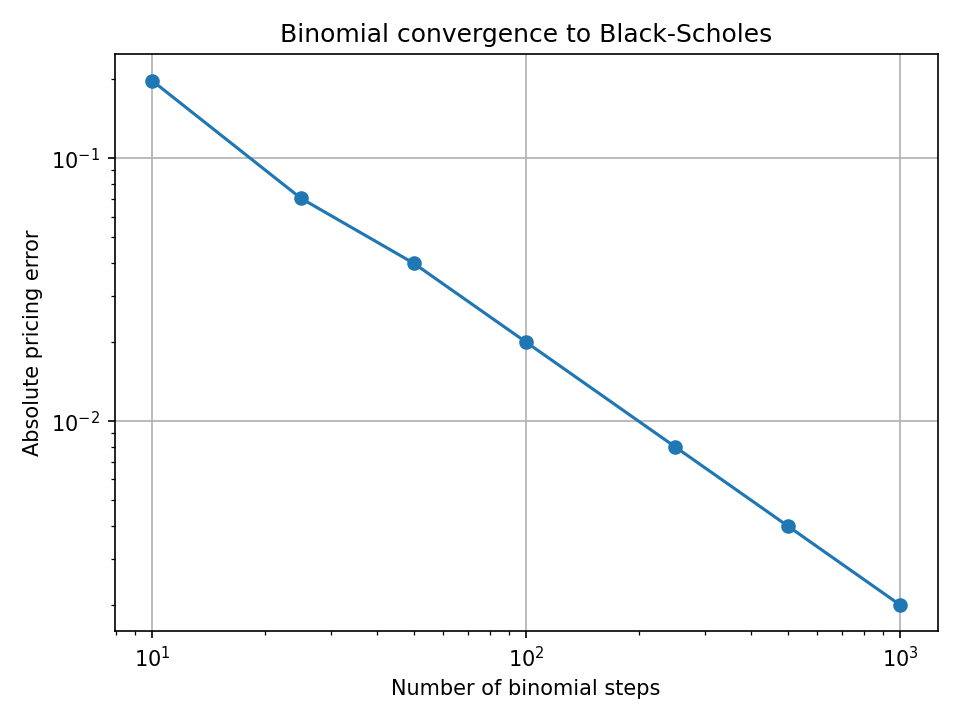
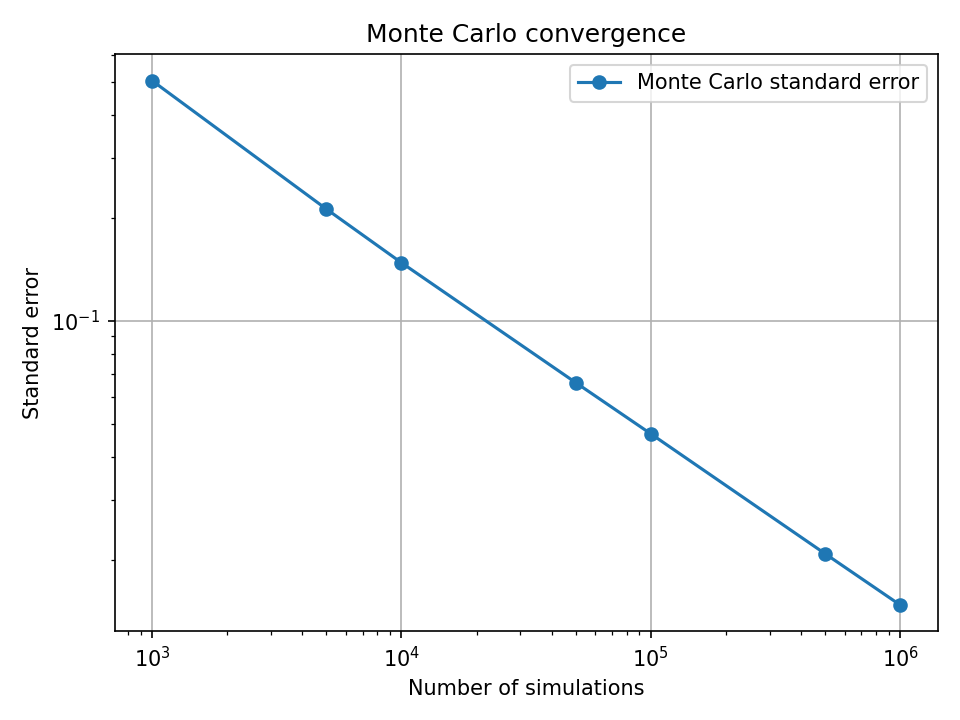
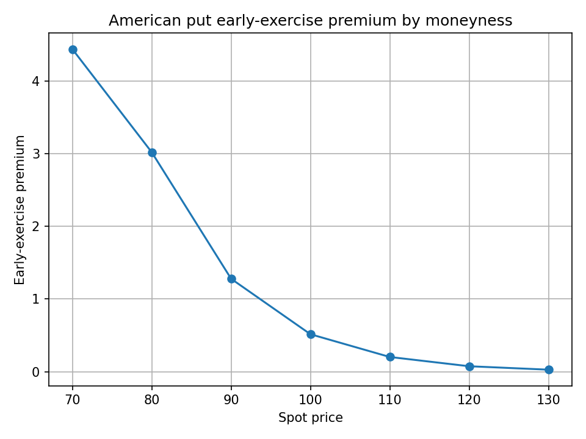

# Numerical Methods for Derivative Pricing

This project investigates numerical methods for option pricing, with a focus on their accuracy and convergence.

Pricing methods are implemented from first principles in C++, beginning with the Black-Scholes model as an analytical benchmark before introducing the Cox-Ross-Rubinstein (CRR) binomial tree and Monte Carlo simulation. The binomial framework is also extended to American put options to examine the effect of early exercise.

Python is used to analyse and visualise the numerical results.

## Black-Scholes benchmark

European call and put prices are implemented using the Black-Scholes formula. The implementation is checked using put-call parity,

\[
C-P=S_0-Ke^{-rT}.
\]

Using \(S_0=100\), \(K=100\), \(r=0.05\), \(\sigma=0.20\) and \(T=1\), the calculated prices are

- Call: 10.4506
- Put: 5.57353

with a put-call parity difference of approximately \(7\times10^{-15}\).

## Binomial pricing

A CRR binomial tree is implemented for European option pricing. At each time step,

\[
u=e^{\sigma\sqrt{\Delta t}}, \qquad d=\frac{1}{u},
\]

and the option value is calculated by backward induction under the risk-neutral probability.

The European call price is compared with the Black-Scholes benchmark for increasing numbers of tree steps. The absolute error falls from 0.1972 with 10 steps to approximately 0.0020 with 1000 steps.

A log-log regression gives an estimated convergence order of **0.9866**, consistent with approximately first-order convergence in this experiment.



## Monte Carlo pricing

European calls are also priced using Monte Carlo simulation under risk-neutral geometric Brownian motion,

\[
S_T=S_0\exp\left[\left(r-\frac{1}{2}\sigma^2\right)T
+\sigma\sqrt{T}Z\right],
\qquad Z\sim N(0,1).
\]

In addition to the estimated price, the implementation calculates the standard error and a 95% confidence interval.

For 100,000 simulations:

```text
Price: 10.4741
Standard error: 0.046708
95% confidence interval: [10.3825, 10.5656]
```

The Black-Scholes benchmark of 10.4506 lies within this interval.

The Monte Carlo standard error is expected to decay at rate \(O(M^{-1/2})\). Across the simulation counts tested, the estimated convergence order is **0.5083**.



The two convergence experiments measure different sources of error: the binomial tree introduces deterministic discretisation error, while Monte Carlo introduces statistical sampling error.

## American put options

The binomial tree is extended to American puts by comparing continuation and immediate exercise values at each node,

\[
V=\max\left(K-S,\,
e^{-r\Delta t}[pV_u+(1-p)V_d]\right).
\]

For the baseline parameters and 500 steps, the American put price is 6.08881 compared with a European put price of 5.57353, giving an early-exercise premium of 0.515284.

The premium is then examined across different spot prices. It is largest when the put is deep in the money and falls as the option moves out of the money. At spot prices of 70 and 80, the calculated American value equals intrinsic value, indicating that immediate exercise is optimal at the initial node for these parameters.



## Project structure

```text
include/     C++ header files
src/         Pricing implementations
tests/       Validation and numerical experiments
analysis/    Python analysis and figures
```

The main implementations are:

- `black_scholes.cpp` — analytical European call and put pricing
- `binomial.cpp` — European CRR and American put pricing
- `monte_carlo.cpp` — Monte Carlo European call pricing and standard error estimation

## Running the project

C++ experiments can be compiled from the project root. For example:

```bash
g++ -std=c++17 -Iinclude src/black_scholes.cpp src/binomial.cpp tests/test_binomial.cpp -o test_binomial
./test_binomial
```

Python dependencies can be installed with:

```bash
pip install -r requirements.txt
```

Analysis scripts can then be run from the project root, for example:

```bash
python3 analysis/binomial_convergence.py
```